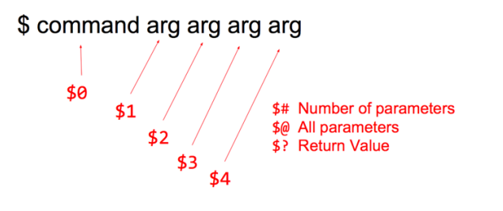
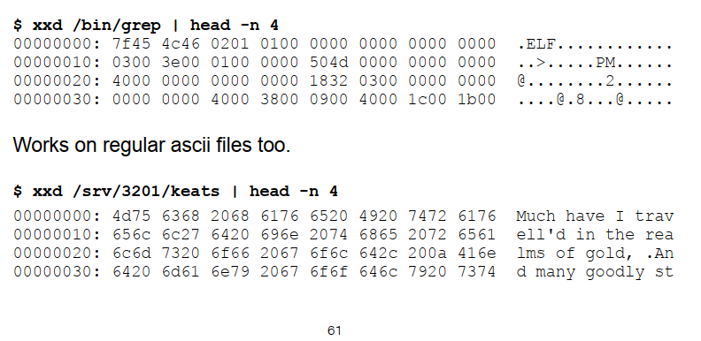
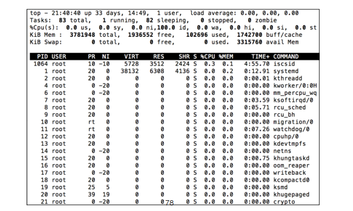

# Dev Tech in Linux Commands + Bash Scripting

## Day 1

* Linux is an operating system

    * operating system = software to manage hardware and software resources

    * 

* $ ssh

    * $ ssh <your username>@<server’s IP address>

* Shell command syntax

    * command [-option(s)] [positional argument(s)]

    * options preceded by - or --

        * $ cat -n file 

        * $ cat --number file 

            * This shows the content of the file with line numbers next to each line

        * single char options can be grouped with one hyphen

            * $ ls -lda directoryName

            * $ ls -l -d -a directoryName

    * standalone -- signifies end of options and beginning of positional args when there is ambiguity

        * $ ls -l -- directoryName

    * positional arguments = file names

* multiple commands can be put on one line if separated by ;

    * $ cd tmp; ls; cd ..

* \# makes the rest of the line a comment, which is useful in shell scripting

    * $ cd tmp # assuming tmp exists

* $ exit and $ logout

    * $ exit

    * $ logout

    * or ctrl-d for EOF character (everything is a file in Linux)

* $ pwd

    * present working directory

    * lists what directory you are currently in (the absolute path)

* $ cd 

    * change directory

    * with no arguments, takes you back to your home directory

        * $ cd

            * other ways to get to home directory

            * $ cd 

            * $ cd ~ # bash preforms tilde substitution and replaces ~ with the absolute path to the home directory; same with $HOME environment variable

            * $ cd $HOME

            * $ cd <absolute path to home directory>

            * $ cd ~<your username> # or put any username to go to their home directory

    * with ., takes you to current directory

        * $ cd .

    * with .., takes you to parent directory

        * $ cd ..

    * with -, takes you to the previous directory you were in

        * $ cd -

    * lecture 4 - cd revisited

        * changes in a child process will not affect the parent (changing directory in the child process doesn’t change directory in the parent process)

            * ex//

                * $ pwd

                * $ bash

                * $ cd /

                * $ exit

                * $ pwd # gives the same path as the first pwd command because the cd in the child (from $ bash) doesn’t affect the parent

* $ ls 

    * lists info about the file or directory

        * usually lists the files or subdirectories in a directory unless use options to specify otherwise

    * $ ls -l # is the long listing of the directory’s content and optional meta info

    * $ ls -a # to see dot files (hidden files)

    * $ ls -d # list directories as files (so show size and meta info instead of contents)

    * $ ls -h # show file sizes in human readable formats (only useful when used with -l)

        * $ ls -lh <filename>

            * shows 917K instead of 938848

    * $ ls -altr dir # show all files (-a) with long listing (-l) sorted in reverse (-r) and the time (-t)

    * $ ls -i # shows the i node number of the file next to the file name 

    * more on ls from lecture 2

        * ls options

            * -l (long listing, show file attributes)

            * -S (sort by size, MUST be capital S)

            * -t (sort by modification time)

            * -r (reverse sort)

            * -h (human readable sizes)

            * -a (show all files including dot files, must use this to show ALL files and directories)

            * -d (show directory as a file rather than showing the contents)

            * -1 (list one file per line (only  useful when listing to screen))

            * -i (show inode number)

* $ cat

    * displays contents of a file or files

    * can concatenate many files together

        * $ cat file1 file2 file3 # prints out contents of all files

    * options:

        * -n (displays line numbering)

        * -t (displays tabs as special characters (^I))

        * -e (displays end of line as special character ($))

        * example:

            * $ cat -nte test-tabs

* $ tail

    * $ tail -n 5 /etc/hosts

        * Gives last 5 lines of the file /etc/hosts

* $ grep

    * Finds and prints matching lines in a text file

    * grep = global regular expression print

    * options:

        * -n (number lines)

        * -i (ignore case)

        * -v (find lines that don’t match)

        * -c (print count of number of matching lines)

        * -l (return filename instead of matching text)

            * ex//

            * $ grep -l "hi" test.txt

                * output:

                * test.txt

            * good for grepping over many files at once and then printing out the filenames with the matching text

            * --include <pattern> (only include filenames matching the patterns)

                * ex//

                    * $ grep -l -r ingham --include "*.txt" literature

                        * \# use double quotes around "*.txt" so that the wildcard expansion isn’t done by the shell and instead of expression is passed to the command

        * -r (recursive)

* $ less

    * "pager" to interactively view a file

    * press space or f to move forward a page

    * press b to move back a page

    * press / to search

    * press n to repeat last search (go to the next match)

    * press shift-n to repeat last search (go backwards)

    * press q to quit

* $ echo

    * prints its arguments to standard out

        * $ echo hello world

            * prints: hello world

        * $ echo ‘hello world’

            * prints: hello world

        * $ echo "hello world"

            * prints: hello world

    * flags:

        * -e # interprets special characters 

            * use for printing white space with echo

            * \t for tab

            * \n for newline

        * $ echo -e "a\nb\nc"

            * output:

                * a

                * b

                * c

        * $ echo "a\nb\nc"

            * output:

                * a\nb\nc

* $ date

    * displays the current time in a given format

    * can be used to set the system date

    * $ date 

        * Mon Feb 26 18:20:13 UTC 2018

    * $ date -I # capital i

        * 2018-02-26

    * $ date -R

        * Mon, 26 Feb 2018 18:21:55 +0000

* $ cal

    * prints a calendar

    * $ cal -m july # prints the month of july for the current year (even if july has past)

* $ seq

    * prints numbers from FIRST to LAST in steps of INCREMENT

    * $ seq 1 10

        * 1

        * 2

        * 3

        * 4

        * 5

        * 6

        * 7

        * 8

        * 9

        * 10

    * $ seq 1 3 20 # starts at 1, goes to 20, increases by 3 each time

        * 1

        * 4

        * 7

        * 10

        * 13

        * 16

        * 19

* $ sleep

    * suspends execution for a specified number of seconds

        * $ sleep 2

* $ man

    * interactively displays a manual page for commands

    * useful to find out about option flags

    * terse output

    * uses same paging and search keys as less command

* $ help

    * displays a help page for commands that may not have $ man entries

* --help option

    * available for many commands

    * tells you how to use that command

        * $ cat --help

* absolute vs relative paths

    * absolute path

        * always refers to the same location

        * starts with "/"

    * relative path

        * specifies a path relative to your current directory

        * starts with a file or directory name (without leading slash) or with . or ..

            * . for current directory

## Day 2

* I/O redirection

    * standard streams

        * STDIN = 0

        * STDOUT = 1

            * STDOUT goes to terminal by defult

        * STDERR = 2

    * redirecting output (STDOUT) using >

        * date > thedate

        * > overwrites the file thedate with the new output

        * > will create the file for you if it doesn’t already exist

    * redirecting output (STDOUT) using >>

        * date >> myoutput

        * >> appends the output to the end of the file (good for log files)

        * >> will create the file if it doesn’t already exist

    * redirecting by not specifying input file

        * many commands (such as cat) take their input from either a file argument or from STDIN if a file for the file argument isn’t specified

        * ex//

            * cat > new_file

            * \# and then start typing b/c no file specified to cat so the keyboard (default STDIN) is used

            * \# press RETURN for new line

            * \# use ctrl-d for end-of-file b/c STDIN is a file

    * redirecting input (STDIN) to take input from a file

        * sort /class/files/keats

        * same as

            * sort < /class/files/keats

    * redirecting STDIN and STDOUT

        * sort < /class/files/keats > sortedkeats

    * redirecting STDERR

        * If you redirect STDOUT but not STDERR, STDERR will still print to the terminal screen.

        * use 2> to redirect STDERR

            * cat /etc/passwd /etc/shadow > new 2>/dev/null

            * \# discard errors by redirecting to /dev/null

            * \# cat two files at once (does cat on the first one followed directly by cat on the second one)

    * redirecting STDOUT and STDERR

        * 2>&1 redirects STDERR (2) to STDOUT (1)

        * 1>&2 redirects STDOUT (1) to STDERR (2)

        * ORDER MATTERS!

            * date sfsf 2>&1 1> log

                * \# redirects STDERR to STDOUT (so both going to terminal) and then redirects STDOUT to log (so STDOUT goes to log and STDERR goes to terminal)

            * date sfsf 1> log 2>&1

                * \# redirects STDOUT to log and then redirects STDERR to STDOUT (so both go to the log)

    * redirection using "Here string"

        * <<< redirects STDIN from a here string (string specified in the command)

            * wc -w <<< "This is a here string"

            * grep "lend" <<< “lend me your ears”

    * redirection using "Here document"

        * << specifies a here document (used to include data in a shell script itself)

            * $ grep dog <<DATA # DATA is some tag used to mark the end of the here document

            * rose flower

            * dog animal

            * blue color

            *  # put tag at end to mark end of here document (must be on its own line)

            * DATA 

        * output from the command above:

            * dog animal

* Pipes

    * output one command becomes the input of the next command

        * $ ps aux | grep firefox | wc -l > output_file

        * \# wc -l takes input from grep firefox output and counts the lines in the file and stores that result in output_file

    * can input interactive commands with pipes (as the last operation)

        * $ cat keats | sort | less

* $ touch

    * creates a file (or multiple files if multiple names provided in one line) if doesn’t (don’t) exist

    * updates the modification time of the file

        * $ touch foo bar baz

    * → DOESN’T take input file, just creates an empty file or updates the timestamp of an existing file

* $ cp

    * copy a file or files

    * Usage:

        * cp [OPTION] SOURCE DEST_FILE

        * cp [OPTION] SOURCE(S) DIRECTORY

            * \# $ cp assumes that if you specify multiple files, the last specified argument is a directory

            * \# therefore, it will fail if the last specified argument isn’t a directory

    * examples:

        * $ cp /class/files/alice.txt . # copies /class/files/alice.txt to the current directory

        * $ cp alice.txt ~/test/my-alice.txt # copy single file to new name and location

        * $ cp keats fstree.dot ~/test # copy multiple files to a directory

    * cases:

<table>
  <tr>
    <td>$ cp f1 f2</td>
    <td>f2 doesn’t exist</td>
    <td>f2 created as copy of f1</td>
  </tr>
  <tr>
    <td>$ cp f1 f2</td>
    <td>f2 exists</td>
    <td>f2 is overwritten (not reversible!)</td>
  </tr>
  <tr>
    <td>$ cp f1 d2</td>
    <td>d2 exists (is a directory)</td>
    <td>puts a copy of f1 in d2</td>
  </tr>
  <tr>
    <td>$ cp f1 d2</td>
    <td>d2/f1 is an existing file</td>
    <td>d2/f1 is overwritten (not reversible!)</td>
  </tr>
  <tr>
    <td>$ cp f1 d2/</td>
    <td>d2 doesn’t exist</td>
    <td>error: can’t create file (not a dir)
b/c the directory doesn’t exist</td>
  </tr>
  <tr>
    <td>$ cp f1 dw</td>
    <td>d2/f1 exists and is a directory (d2/f1 is a directory)</td>
    <td>error: can’t overwrite dir with file</td>
  </tr>
  <tr>
    <td>$ cp d1 x</td>
    <td>d1 is a directory</td>
    <td>error: can’t copy directory 
b/c -R flag wasn’t used</td>
  </tr>
</table>

    * recursive copy

        * use -R flag to recursively copy the specified directory and contents of all subdirectories

            * $ cp -R dirname target_dir

            * $ cp -R dirname1 dirname2 target_dir

* $ mv

    * move a file or a directory

        * changes the location of a file or renames it

    * cases:

<table>
  <tr>
    <td>$ mv f1 f2</td>
    <td>f2 doesn’t exist</td>
    <td>renames f1 to f2</td>
  </tr>
  <tr>
    <td>$ mv f1 f2</td>
    <td>f2 exists</td>
    <td>renames f1 to f2 and old f2 is removed (not reversible!)</td>
  </tr>
  <tr>
    <td>$ mv f1 d2</td>
    <td>d2 is a directory</td>
    <td>moves f1 into d2</td>
  </tr>
  <tr>
    <td>$ mv f1 d2/</td>
    <td>d2 is a directory </td>
    <td>moves f1 into d2</td>
  </tr>
  <tr>
    <td>$ mv f1 d2</td>
    <td>d2/f1 exists</td>
    <td>moves f1 into d2 and removes old d2/f1 (not reversible) </td>
  </tr>
</table>

* $ rm

    * removes a file or files

        * rm a.txt b.txt

    * -r recursively removes directories and their contents (be careful!)

        * rm -r dirname	

* -i flagfvar

    * rm, cp, mv take -i flag that asks you if you are sure before removing or overwriting a file

    * mv -i a b

* $ mkdir

    * creates directory or directories

        * mkdir adir bdir

    * can’t make directory and subdirectories in one line

        * $ mdkir newer/sub IS NOT VALID and WILL CAUSE ERROR

* $ rmdir

    * remove a directory (only works on empty directories, safer than using rm -r b/c then you won’t accidentally delete your work)

        * $ rmdir newdir

* $ wc

    * prints count of lines, words, and characters

        * $ wc /class/files/keats

    * use -l to just get line count

* $ head and $ tail

    * head shows beginning of file(s)

    * tail shows end of file(s)

    * both have default of 10 lines

    * options:

        * -n (number of lines to output (defaults to 10))

        * -q (inhibits headers saying file name when doing on several files)

    * $ head -n 

        * can output from start to line N from the end if use negative number after n

            * $ head -n -5 keats # from start to 5 lines from the end

    * $ tail -n

        * can output from line N until the end by putting + in front of option value

            * $ tail -n +5 keats # from line 5 to end

* $ sort

    * sort a file (default in alphabetically per line so based on the first character of the line)

    * options:

        * -r (reverse)

        * -f (ignore case)

        * -k field[.endchar} (and other char options to compare char positions in field) → MUST include -k and what column to sort by if don’t want to use the first one (default) ex// if want to sort by size with ls, need to use -k 5 since the size is in the 5th column from the left

            * $ sort -r -k 2.3 words-w-lengths # reverse sort (z at top, a at bottom) on field 2, char 2

            * $ sort -rn -k 1 words-w-lengths # numeric reverse sort on field 1

        * -n (numeric comparison)

            * need -n so does sort by number (integer) instead of by character value of that number in ASCII

* $ basename and $ dirname

    * $ basename fortune

    * fortune

    * $ basename ./fortune

    * fortune

    * $ basename /class/homework3/rc2447/fortune

    * fortune

    * $ dirname /class/homework3/rc2447/fortune

    * /class/homework3/rc2447

* $ file

    * displays the file type

        * ex// ASCII, shell script, executable, JPEG image

* wildcards (filename expansion) aka glob

    * can be used to match file names

    * ? matches any single character

        * $ ls /bin/d? # gives all files that have exactly one character after the d in /bin

    * * matches zero or more characters

        * $ ls /bin/cp*  # gives all file stat start with cp in bin/

    * [xyz] matches any single character in the set xyz → good for matching lower or uppercase version of the letter

        * $ ls d[a-e]

    * [!xyz] specifies a set or range to exclude

        * $ ls d[!a-e]

    * WILDCARDS NEVER MATCH THE LEADING PERIOD (dot) ON HIDDEN FILES (dot files)

        * $ ls *

        * $ ls ?foo

        * $ ls [.]foo 

        * → ALL WON’T MATCH .foo

    * Examples:

        * $ cp test* subdir/ # copy files starting with "test" in current directory into subdir

    * wildcard characters are NOT expanded when quoted 

    * wildcard characters are preprocessed by bash where the expression is substituted into the command BEFORE running the program/executing the command

        * → so commands never see the wildcards

        * ex//

            * $ cat *-bb # becomes cat bar-bb foo-bb

    * unmatched wildcards 

        * if Bash can’t match a wildcard pattern against an existing pathname, the pattern is passed unchanged to the command

            * ex//

            * cp junk xyz*abc # and xyz*abc doesn’t match any path

                * output:

                    * $ ls

                    * xyz*abc

                * so junk was actually copied to a file called xyz*abc

    * double and single quotes stop wildcards from expanding

    * example:

        * $ echo cp aa-11 bb*

        * cp aa-11 bb-11 bb-22 bb-33

            * this cp command would fail IF bb-33 is NOT a directory because cp expects that the last argument will be a directory if multiple files are passed

* Escaping special characters

    * backslash → removes the special meaning

    * ex//

        * $ echo a\*

            * output:

            * a*

            * doesn’t output all possible matchings in the current subdirectory that start with a

    * whatever follows \ is treated as a literal character 

* File attributes

    * -rw-r--r--

        * very first dash tells the file type

        * - = regular file

        * d = directory

        * l = link

        * b = block

        * c = character devices (ex// /dev/null)

    * -rw-r--r--

        * all the characters besides the first dash tell the permissions

            * r = read

            * w = write

            * x = execute

        * one group of three for each user (owner), group, world

        * dot after permissions (often not there) = that the file has "extended attributes"

    * after permissions comes a number that is the link count

        * for files, usually 1

        * for directories, 2 + n where n is number of subdirectories

    * then the username of the owner of the file

    * then the group that owns the file

    * then the size of the file (usually in bytes)

    * then the file last modified time

        * this can be updated without changing the file using the touch command

    * finally, the name of the file

        * filenames have NO internal structure, just conventions

* $ chmod

    * allows the owner of the file to change the file’s permissions

* specifying file permissions

    * symbolic permissions

<table>
  <tr>
    <td>u = user</td>
    <td>to turn on 
to turn off</td>
    <td>r = file contents can be read</td>
  </tr>
  <tr>
    <td>g = group</td>
    <td></td>
    <td>w = file can be written (modified)</td>
  </tr>
  <tr>
    <td>o = other (world)</td>
    <td></td>
    <td>x = file can be executed (ex// program or script)</td>
  </tr>
  <tr>
    <td>a = all</td>
    <td></td>
    <td></td>
  </tr>
</table>

        * ex// make group writeable

            * $ chmod g+w alice.txt

    * octal permissions

        * convert binary to octal (same as converting to decimal b/c small numbers)

        * rwx

        * _ _ _

        * ^^^^^ put 1 to turn on rwx in the rwx spot and put 0 to turn off

        * ex//

            * set user to 6, group to 6, world to 4

            * $ chmod 664 alice.txt

        * use -R with chmod to recursively change permissions of an entire directory hierarchy

            * $ chmod -R g+rw mydir/

* $ chown and $ sudo

    * chown changes the owner of a file and must be done with sudo

    * $ sudo chown username foo

* $ chgrp

    * user can change the group of files that they own IF they’re in the group themselves

* $ whoami

    * how to find out who you are (your username)

    * $ whoami

    * $ who am i 

        * \# gives more info than whoami

* $ id and $ groups

    * $ id returns a numeric user ID (uid) and numeric group id (gid)

        * $ groups returns primary group id (gid, not numeric) plus other groups for the current user

    * $ id someuser

        * $ groups someuser

            * → $ id and $ groups can be used for specific users as well

## Day 3 

From lecture 2 slides:

* Directory permissions

    * executable -- cd into a directory or access files in a directory

    * readable -- see the contents of a directory only if the directory is readable

    * writable -- can only add, rename, or remove files in a directory if it is writeable

* Directory vs file permissions

    * To delete a file, you need write permissions on the DIRECTORY because you are modifying the contents of the directory, not the contents of the file

        * when deleting a file where you don’t have permissions to write to the file but you can write to the directory, rm will check with you before deleting the file

        * if don’t have write permissions on the directory, you will get "Permission denied" when you try to remove the file

    * DELETING = writing to the parent of the object (parent of the files is the directory, parent of the directory is its parent directory)

From lecture 3 slides:

* Inodes

    * Inodes: store meta-data associated with the file (type, permissions, ownership, timestamps) and the disk block location for the file

        * DOESN’T store the filename

        * directory maps filename to inode number

* $ stat

    * extracts info about the file from the file’s inode

    * three dates/times associated with every file

        * last modified ($ ls -l shows this time too, can be updated using touch)

        * last changed (including when file is renamed)

        * last accessed

* Links

    * allow multiple files to point to the same underlying data

    * hard link and soft link

    * use:

        * link file to home directory so don’t have to search for it a lot

        * shorten file name, especially if has long version number

        * make programs accessible from multiple places

* HARD LINK

    * directory entry (filename to inode number) that refers to an existing inode

        * allows same inode to be accessed from different pathnames

        * points to the exact same file, increases the reference count for the inode

            * When the files is deleted, the reference count is decremented. When it becomes zero, the file is actually removed from the disk.

            * 

    * hard links are older than symbolics and not used a frequently

    * limitations:

        * can’t be used across file systems

        * can’t be used on directories

    * CREATING a hardlink: $ ln old new

* $ ln 

    * used with no flags to create a hard link

        * $ ln old new

        * hard link = share underlying data

        * use $ ls -l to see the link count (in the 2nd column)

    * used with -s flag to create a soft link

        * $ ln -s sold snew

        * creates a new file that links to old file, doesn’t increment the reference count on the old file and has own inode number

* SYMBOLIC (soft) LINKS

    * a file (with its own inode, doesn’t increment the reference count to the file) that is distinct from its target but points to the target file

    * newer than hard links and more frequently used

    * CAN be used across file systems

    * CAN be used on directories

    * CREATING a soft link: $ ln -s sfile snew

    * removing soft link = just removes the inode for the soft link, doesn’t affect the original file

    * remove/change name of original file = the symbolic file is still there, but it has a stale (null probably) pointer that will give an error if you try to access the file through it

* Shell variables

    * shell variables = local to existing shell (that one process)

    * environment variables = variables that are exported so their values are accessible to sub-shells, shell scripts, or executed programs

        * when a subshell or program is run, the enviro variables are passed to it

    * Set a variable with equals with NO SPACES around it (=)

        * if you put a space, bash will try to run the first part (variable name) as a command with the = as an argument

    * Access the value of the variable with the dollar sign ($)

    * ex// 

        * $ foo="hello world” # first $ is for the command prompt

        * $ echo $foo

    * variable naming rules

        * composed of a-z, A-Z, _ and 0-9 only

        * CANNOT begin with a number

        * convention is to capitalize environment variables

    * QUOTES

        * need to put DOUBLE QUOTES around variables so that when they are expanded, the spaces are within a string

            * variables are expanded BEFORE running the command (preprocessed)

            * ex//

                * $ file="/tmp/my file”

                * $ basename "$file"

                * output

                    * my file

        * variables in SINGLE QUOTES are NOT expanded

            * ex//

                * $ echo ‘my homedir is $HOME’

                * output:

                    * my homedir is $HOME

    * Command substitution (capturing the output of a command into a variable)

    * ex//

        * $ foo=$(date)

        * $ echo $foo

        * output:

            * gives date from the date command at the time the date command was run

    * older versions of bash used backquotes instead of $() to invoke command substitution

        * ex//

            * $ foo=`date`

            * $ echo $foo

            * output:

                * gives date from the date command at the time the date command was run

* Arithmetic expansion

    * $((expression))

    * variables inside arithmetic expressions don’t need $ before them because they are assumed to be numbers

    * arithmetic expressions can be computed and their outputs can be captured

    * ex//

        * $ foo=33

        * $ bar=$((foo+11))

        * $ echo $bar

        * output:

            * 44

* $ env

    * prints all of the environment variables

    * can also be used to run another program with a temporarily modified environment

    * can take zero or more arguments 

    * ex//

        * $ env

        * output:

            * prints out SHELL=/bin/bash etc

* $ printenv

    * prints environment variables or a specified one

    * ex//

        * $ printenv TERM

        * output:

            * xterm

* Ways to view an environment variables value

    * $ printenv HOME

    * $ env | grep HOME

    * $ echo $HOME

    * can pipe env into less to search interactively

* $ set

    * lists all environment variables and shell variables

    * can also be used to assign shell options (discussed in a later lecture)

    * ex//

        * $ set

* $ read

    * reads a line from stdin and splits it into separate fields (at a space for all but the last one) that can be assigned to separate shell variables

    * ex//

        * $ read a b c

        * 1 2 3

        * $ echo $a $b $c

        * outputs:

            * 1 2 3

    * If there are FEWER variables than fields, the LAST variable will get the remainder of the line

    * CAN’T use read variable with pipe because command after pipe is run with exec’d so it is running in its own subshell and never returns (because exec only returns on error) so the variable is never given to the parent process

        * better:

            * $ read first second <<< "hello world" # fill in variables using here string because then the shell variables (local variables) will be set in this environment

* $ which

    * shows matching command (if any) in $PATH

    * ex//

        * $ which cat

        * outputs:

            * /bin/cat

    * gives you an absolute path you can use to run the command with so bash doesn’t have to do the lookup in $PATH

    * doesn’t give a path for built-in commands because they have no path because they are built-in

* Built-in commands

    * most commands live on the file system and have to be exec’d to be run

    * built-in commands are part of the shell and DON’T need to be exec’d and CAN’T be found by using which (because they have no path because they are built-in)

    * ex// cd and read are built-ins but grep isn’t

    * reasoning:

        * commands that CHANGE the state of the SHELL

        * for efficiency (ex// echo and pwd are built in for efficiency)

* $ type

    * shows a command’s pathname and (UNLIKE which), whether the command is a built in or not and what its aliases are

    * simple rule: use type instead of which

* Editors:

    * vi/vim, emacs, nano

* Shell Scripts

    * used for:

        * task automation

        * wrap programs over which you have no control in environments over which you do have control

        * easier and more transparent and portable than writing a custom program

    * script = sequence of commands written in a file

        * written exactly as you would type it into the command prompt

    * can pass parameters to shell scripts and they return an exit code

    * ex// hello world

        * inside hello.sh type:

            * \#!/bin/bash

            * echo "Hello world!"

    * running shell script: 

        * need to specify the PATH to the file

            * ex// ./hello.sh

            * if hello.sh is in your current directory

        * need to change the permissions so that the shell script is executable 

            * ex// chmod 744 hello.sh

            * ex// chmod u+x hello.sh

                * permissions are copied when you make a copy of a file

                    * (if you make a file using $ cp, you don’t have to change the permissions on the file because it will inherit the permissions of the file of which it is a copy)

* Hash bang - shell script

    * FIRST LINE of a shell scripted (prefixed by #!) that specifies what program to use to interpret the rest of the commands

    * really just a comment that gets specially interpreted by the command line

    * ex//

        * \#!/bin/bash

        * \#!/bin/sh

        * \#!/usr/bin/python

* Exit with status

    * all commands (including shell scripts) return an exit status code

        * 0 is success, non-zero is failure

        * ex//

            * $ exit # default is zero

            * $ exit 8 # exit with status 8 to say an error occurred

    * to find the exit value returned by the last command, check $?

        * $ grep randomnnnnn foo.txt

        * $ echo $?

            * output:

                * 1

            * because grep returns 1 when it can’t find the string in the give text

        * $ grep hello hello.txt

            * output:

                * 0

            * because grep successfully found hello

        * $ grep randommmmm stuffffffff

        * $ echo $?

            * output:

                * 2

            * because grep failed because the file doesn’t exist

* Logical operators &&, ||, !

    * do short-circuit evaluation

        * a && b # b evaluated only if exit status of a is zero

        * a || b # b evaluated only if exit status of a is nonzero

        * ! # negates the exit status of the command (0 → 1, non-zero → 0)

* Shell script arguments

    * command line arguments list

    * $ command arg arg arg arg

    *    

    * use $0 variable to get the command run (can use it to find out what command was run before symbolic link was followed, for example)

    * $1 etc to get the arguments passed to the command

    * $# gives you the total number of parameters passed to the command → good for ERROR CHECKING

    * $@ gives you a set of all of the parameters  

    * $? gives you the return value (the exit status of the last command called)  

* checking script args

    * if error, output error message to STDERR and return a non-zero error code

    * ex// if the input is a file name, check if the file exists etc.

    * ex//

        * if [[ $# -ne 1 ]]; then

            * echo "Usage $0 dir" 1>&2 # need to redirect STDOUT to STDERR because echo prints to stdout and this is an error message

            * exit 1

        * fi

        * dir="$1”

        * if [[ ! -d "$dir" ]]; then # remember the quotes around “$dir” and remember the $, this line is the same as if ! test -d “$dir”; then

            * echo "Error: directory $dir not found." 1>&2 # remember to redirect the output of echo to STDERR since this is an error message

            * exit 2

        * fi

* if statements

    * else is optional

    * optional number of elif clauses

    * end with fi

    * if-command can run any command as the conditional and just checks the exit status of that command (0 = true, non-zero = false)

    * ex//

        * if test-commands

        * then

            * commands

        * else

            * commands

        * fi     

    * ex//

        * if test-commands; then # use ; to separate multiple commands on the same line

            * commands

        * elif test-commands; then

            * commands

        * else

            * commands

        * fi

* $ test

    * command that performs comparisons and returns 0 on success and 1 on failure

    * ex//

        * $ test 10 -eq 10 # -eq for equal, say is 10 equal to 10?

        * $ echo $?

            * output:

                * 0 

            * b/c success

    * lots of options (don’t need to memorize → just google what you need)

        * 

* Comparisons

    * [......] is for standard comparison (shorthand for $ test command)

        * requires spaces on either side (b/c [ is a command and all things that follow, including ], are arguments)

            * ex//

                * if [ "$count" -eq 10 ]

            * same as

                * if test "$count" -eq 10

    * [[......]] is for extended comparison (bash specific with extra capabilities)

        * variables don’t need quotes (spaces in variable values handled automatically)

        * supports logical oeprators && and || for logical connectives within the brackets

        * supports pattern matching

    * ((.......)) is for integer comparison (comparison (instead of computation) equivalent to $((....)) for arithmetic expansion)

        * doesn’t need to dereference variables with $ or use quotes (but can) since they are automatically assumed to be numbers)

        * can use ==, !=, >, <, >=, <= for integer comparison b/c < and > will be interpreted arithmetically and not as IO redirection

        * don’t need spaces around the (()) (but can have them)

        * ex//

            * if ((count>10))

    * can use == and != for string comparison

    * negation operator has same effect inside and outside test command

        * ex//

                * if ! [ "$animal" == “duck” ]

            * is the same as

                * if [ ! "$animal" == “duck” ]

        * because you are just negating the exit status of the last command run

* While loops

    * ex//

        * number=5

        * while ((number > 0)); do

            * echo $number

            * number=$((number - 1))

            * sleep 1

        * done

    * ex// by default, : is synonymous with true

        * while :

        * do 

            * echo hello

            * sleep 1

        * done

* for loops

    * ex//

        * for file in *.sh; do

            * echo "$file"

        * done

    * ex//

        * for ii in $(seq 1 3); do

            * echo $ii

        * done

    * ex//

        * for a in {1..10}; do echo $a; done;

    * ex//

        * for a in a b c; do echo $a; done;

    * Also handles c-like iteration variable syntax

        * for ((a=1; a<=5; a++)); do echo $a; done;

* break and continue

    * commands that all you to exit a loop (break) or skip to the next iteration (continue)

* checking exit status of commands

    * check $? value after exiting certain commands so you don’t continue if there has been an error (ex// touch fails and the file is never created)

* true and false

    * true = built-in command that returns exit code of 0

    * false = built-in command that returns exit code of 1

* $ sh, $ bash

    * the shell can run any program including itself and other shells

    * $ sh # runs the default shell

    * $ bash # runs bash

    * when give a script file, the shell opens the file, executes it, and then exits

    * essentially the same:

        * $ bash myscript.sh

        * $ bash < myscript.sh

        * myscrippt.sh

            * if shell is called with $ bash or $ sh, then #/bin/bash or #/bin/sh isn’t needed because that shell is already running

## Day 4

* $ tee

    * copies stdin to stdout, making a copy in zero or more files

    * useful for capturing intermediate results in a pipe chain

        * ex//

            * $ sort m.txt | tee m.s | grep candle

        * saves the result from sort m.txt into m.s and then passes the result from sort m.txt to grep candle, overwrites the m.s file each time it is called

* $ uniq

    * finds and processes duplicate lines in a sorted file

    * removes duplicate files in the listing by default and lists just one of each copy

    * -c # flag to get the count of the number of duplicates next to their name

        * ex//

            * outputs:

            * 2 aa

            * if have two files called aa

    * -d # flag to get a list of just the files with duplicates (just one list of each file)

    * -u # flag to get a list of the files that don’t have duplicates only (unique lines)

* $ tr

    * USED A LOT

    * translates one set of characters to another

    * ex//

        * $ cat keats | tr e ‘*’

            * needs to put * in quotes so it isn’t expanded as a wildcard (both single and double quotes should work)

            * changes all e’s to *’s

        * $ cat keats | tr a-z A-Z

            * changes all the lowercase letters to uppercase letters

        * $ cat keats | tr [[:lower:]] [[:upper:]]

            * changes all the lowercase letters to uppercase letters

        * $ echo $PATH | tr ":" “\n”

            * changes all : in the path to \n to print out all the paths in the PATH environment variable

    * $ tr always needs something piped into it

    * flags:

        * -d # to delete characters

            * ex//

                * $ echo abcccd | tr -d c

                * output:

                    * abd

        * -s # squeeze, take away the repeats of the character (for the sequence of characters)

            * ex//

                * $ echo abcccdc | tr -s c

                * output:

                    * abcdc

            * useful for removing extra spaces

    * ex//

        * convert tabs to dashes (tr automatically understands special characters automatically)

        * echo -e "a\tb\tc" | tr “\t” ‘-’

* $ cut

    * USED A LOT

    * removes sections from each line of input

    * flags:

        * -c # indicates characters (column) to select

            * gives these columns as the output, starts counting at 1

        * -f # indicates a list of fields (separated by delimiter)

        * -d # changes the default field delimiter (default is tab)

    * ex// 

        * $ tail -2 keats | cut -f 2-4 -d " “

            * says that the delimiter is a space (instead of a tab) and then cuts the 2nd to the 4th word (3 words total, inclusive of 4)

    * ex//

        * $ ls -l | cut -f 1-1 -d " “ | sort | uniq

            * gives just the permissions from ls in sorted order and removes any duplicate permissions lines to leave only one copy of each

    * ex//

        * $ ls -l /class/files | tr -s ‘ ‘ | cut -f 1.9 -d ‘ ‘

* $ find

    * searches for files in a directory hierarchy

        * searching in the whole directory tree

    * flags:

        * -name <pattern> # basename matches wildcard pattern

        * -regex <pattern> # full file name matches regular expression pattern

        * -exec command # executes command for each file

        * -type: file_type # d for directory, f for regular file, l for symbolic link

        * -ctime n # file status was last changed n*24 hours ago (n gives days ago)

    * ex//

        * $ find . -name "macbeth.*"

        * $ find . -regex "macbeth.*"

        * $ find . -name "*.txt" -exec grep Bin {} \; | wc -l

            * {} are used to represent where the filename found by find goes so grep can run on it (for all matching filenames)

            * need \; to mark the end of the expression

        * don’t need to worry about + command

* $ alias

    * can be used to create or display aliases

    * an alias is a synonym for another command or group of commands

    * ex//

        * $ alias ll # shows you the alias for ll (what the actual commands behind ll are)

    * ex// create and alias for the root directory

        * $ alias cdroot = "cd /"

            * / is the root directory

        * $ type cdroot

            * tells you that the type is alias

    * ex//

        * $ alias # with no arguments, alias just lists all the current aliases

    * some aliases are set by default in the .bashrc when you create a new user

* $ unalias

    * removes an alias

* $ source

    * reads a file and treats each line as if it were entered in the current shell

    * WILL CHANGE SHELL VARIABLES IN THE CURRENT SHELL (no exec)

        * ignores the #!/bin/bash line in scripts that are source’d b/c views that as just a comment

    * ex//

        * $ source ~/.bashrc

    * Variables that are NOT exported don’t get passed down to subshells (children)

    * Exported variables to get passed down to subshells

        * ex//

            * $ bash

            * $ export foo="hi”

            * $ bash

            * $ echo $foo

                * outputs:

                    * "hi"

    * can call source with a script and all the shell variables in the script will be set in the current shell (no exec)

        * ex//

            * $ source message.sh

* .bashrc and .bash_profile

    * lets you customize your environment

    * .bash_profile runs when you log in

    * .bashrc runs when you start a new bash session (without logging in again, ex// $ bash)

    * ex//

        * $ source ~/.bashrc

* $ history

    * not very important

    * prints out and allows you to re-execute previous commands sorted in ~/.bash_history

        * ex// 

            * $ history 5 # lets you see the last 5 commands

        * ex//

            * $ history -c # clear history

        * ex//

            * $ history -w # write changed history

    * variables that get expanded base on history

        * ex//

            * $ !32 # re-execute command number 32 that was 32 commands before now

        * ex//

            * $ !! # runs the previous command again	

* Regular expressions 

    * used for pattern matching with strings of text (ex// grep)

    * useful for searching for pattern in large files/output

    * NOT expanded by the shell (unlike wildcards, which are expanded by the shell)

        * regular expressions are actually passed to the commands that take them (NOT preprocessed)

    * WILDCARDS must match the WHOLE filename but REGEXP matches any SUBSTRING

    * operators:

        * 

        * 

    * .* matches 0 or more occurrences of anything

        * because * means zero or more repetitions and . means anything

    * anchoring at start/end

        * use ^ to match from beginning

        * use $ to match from end ($ for end-of-line)

        * ex//

            * $ ls /bin | grep "^n.*e$"

    * bracket expressions

        * a list of characters enclosed by [] matches with any SINGLE character in that list

        * ex// words that end with d or g

            * $ grep "[dg]$" /usr/share/dict/words

        * can contain character classes

            * 

            * ex//

                * $ grep [[:punct:]] words # need two sets of [] because one for the bracket expression and one for the character class

        * use [^.......] to specify characters to exclude

            * NOT the same as ^ outside of the brackets, which is used to anchor to the beginning of the line (must start at the beginning of the line)

                * ex// count words not beginning with a, b, or c

                    * $ grep ^[^abc} words.txt

        * Regex - grouping

            * MUST use -E with grep because this is an extended grep feature

            * (.....) allows you to look for groups of characters

                * ex//

                    * $ grep -E ‘^(pa){2,}’ /class/files/words

                        * \# (pa) allows you to look for pa next to each other only

        * Regex - logical or

            * MUST use -E with grep because this is an extended grep feature

            * Use | to match one of multiple patterns (this or that)

            * ex//

                * $ grep -E ‘qq|xx|yy’ words

        * Regex in extended comparisons

            * use =~ to test if a regular expressions matches (would give) some result in boolean expressions)

                * ex//

                    * if [[ "$name" =~ ^z.* || “$name” =~ .*z$ ]]

                        * then echo "start or end"

                    * else echo "not start nor end"

                    * fi

            * NOTE: if the right side (^z.* or .*z$) are in quotes, then the regex characters are treated as literals (not regex)

    * Regex vs wildcard

        * regex: .*  for zero or more of any char

        * wildcard: * for zero or more of any char

            * regex: . for one char

            * wildcard: ? for one char

                * regex: (cat|dog).* for begins with cat or dog

                * wildcard: {cat,dog}* for begins with cat or dog

                    * regex: [^a-c] for negation of a character set

                    * wildcard: [!a-c] for negation of a character set

    * escaping characters

        * remove special meaning of regular expression characters by putting \ in front of them

            * ex// grep ‘foo\*’ test

                * remember: single and double quotes stop wildcards from expanding and, here, allow regex to be written with * for any number of characters (are required for regex to be passed to commands such as grep)

* $ egrep

    * same as grep -E

    * supports extended regular expressions

    * created by Aho

* ${var}

    * can use ${} to refer to a variable

    * useful for embedding variables in strings

    * ex//

        * $ linux=fun

        * $ echo ${linux}software

            * output:

            * funsoftware

    * can be used to specify a SUBSTRING

        * ${parameter:offset:length}

        * ex//

            * $ var=abcdefghijklm

            * $ echo ${var:8} # gives everything after the 8th character INCLUDING the 8th character

                * output:

                    * ijklm

            * $ echo ${var:8:3} # gives just 3 letters after the 8th character INCLUDING the 8th character

                * output:

                    * ijk

        * 

        * use ${var#} to return the length of a variable

            * based on filename style pattern, not regex

        * ex// remove min match of wildcard pattern ".*" FROM THE END

            * $ echo $BASH_VERSION

                * output:

                    * 4.3.48(1)-release

            * $ echo ${BASH_VERSION%.*}

                * output:

                    * 4.3

    * example: using substring variable expansion in a loop to rename files

    * for f in *.foo

    * do

        * mv -- "$f" “${f%.foo}.bar”;

    * done

        * note: that -- causes everything that follows to be treated as positional arguments (not as flags, helps protect against the filename accidentally being interpreted as a flag to mv)

        * remember: put filename in quotes ("$f") in case it contains spaces

        * 

* Customizing $PATH environment variable

    * you can add new directories to the search path

    * the paths are searched in the order they are listed (first path first, then the second path etc)

    * ex//

        * $ PATH=$PATH:/class/files/scripts

        * $ PATH=/class/files/scripts:$PATH

    * from lecture 3:

        * $PATH -- environment variable

            * How does bash find the correct program to run?

                * It uses the PATH environment variable and searches in the directories for that command in the order that the directories are listed in the PATH variable

* Command grouping and subshells

    * grouped commands are executed as a unit

        * redirections may be applied to the entire command (will be one stream)

    * (cmd1; cmd2;...; cmdN)

        * a subshell environment is created and each command is executed in that subshell (so shell variables don’t remain after the command runs; the command is exec’d)

        * whitespace around () and ; is NOT required

    * { cmd1; cmd2; …; cmdN; }

        * using {}, the commands are executed in the current shell context so the changes to variables DO remain after the command runs

        * braces {} are reserved words so they must be separated from the commands by spaces (whitespace after { and before } IS required)

    * ex// put all output (including error and warning messages) in a file called out

        * $ (ls /sdfsdf; ls /class; ls /home) > out 2>&1

            * redirects STDOUT to out and then redirects STDERR to STDOUT, which is already redirected to out so STDERR goes to out too

* More expansions - brace expansion

    * 

    * 

    * brace expansion

        * specifies a list of items that are combined in all combinations with the remainder of the pattern (purely textual)

        * $ echo b{a,e,i,u}t

            * output:

            * bat bet bit but

        * you can have multiple sets of braces in a pattern

        * ex//

            * $ echo dir{1..6}

                * output

                    * dir1 dir2 dir3 dir4 dir5 dir6

            * $ mkdir test{1..6}

        * ex//

            * $ echo result-{a..j..3} # a to j but increment by 3 each time

                * result-a result-d result-g result-j

        * brace expansion happens before wildcard expansion

            * 

* Three special permission bits for files

    * setuid bit

        * allows you to execute the file with the permissions of the owner

            * lowercase s shows up in place of x in permissions when both setuid bit is on and execute bit is one

            * uppercase S shows up in place of x in permissions when just setuid bit is on (execute is off)

        * $ chmod u+s file

        * used commonly for the permissions of /usr/bin/passwd so a user can act as root and change their own password

    * setgid bit

        * allows you to execute with the permissions of the file’s group

        * lowercase s shows up in place of x in permissions when both setuid bit is on and execute bit is one

        * uppercase S shows up in place of x in permissions when just setuid bit is on (execute is off)

        * $ chmod g+s file

        * when setgid bit is on for a directory, then the files created in the directory belong to the directory’s group, not the user’s group

            * good for when users from diff groups want to make files in the same directory 

            * ex// used on homework directories so that the files belong to the TA group so the TA can view everything

    * sticky bit

        * used on shared writable directories

        * users can create files, read, and execute files owned by other users but CAN’T remove files owned by other users

            * at the end of the permissions

                * t when permissions are one

                * T when permissions are off

                * ex// $ ls -ld /tmp

                * output:

                    * drwxrwxrwt …….

            * changing the sticky bit:

                * $ chmod o+t bbn

                    * (o for world)

    * all of these (sticky bit, setuid, setgid) can be changed with octal by specifying another, higher order bit (setuid=4, setgid=2, sticky=1)

        * ex// $ chmod 5664 bbb # the 5 is the bit being used to set the setuid and sticky bits here)

        * output:

            * -rwSrw-r-T

## Day 5

* $ umask

    *  a permissions triplet that specifies the BITS TO REMOVE from the default permissions

        * default permissions:

            * regular files: 666 (rw-)

            * directories: 777 (rwx)

        * ex//

            * $ umask -S # view symbolic permissions

            * $ umask 022 # octal (no write for group nor world)

* Backslash for multi-line commands

    * use \ at the end of a line to continue a command to the next line (so enter doesn’t create a new line and mess up the command)

* Protecting against oddly named files

    * 1) use quotes are variables that hold file names in case the file names have spaces in them

        * ex//

            * $ myfile="bad file"

            * $ cat $myfile # gives error

            * $ cat "$myfile" # all good

    * 2) use quotes around command substitution 

        * ex// "$(pwd)"

    * 3) prefix wildcards with ./ if only want to search in the current directory

        * ex// $ cat ./* instead of $ cat *

    * 4) use -- to separate options from arguments

        * ex// $ cat -- -n # to cat a file called -n

* Functions in bash scripts (don’t worry about this)

    * used to group a bunch of commands together

    * functions can be passed arguments that are automatically assigned to $1, $2, etc.

        * you don’t have to specify that the function takes arguments

    * ex//

        * my_fun () { body; }

        * or

        * function my_fun { body; }

    * return <value> is a command used in functions that returns an exit code from the function (stored in the $? variable automatically) 

        * ex//

            * print_something () { # don’t need to specify that the function takes arguments

                * echo You entered: \"$1\”

                * return 5

            * }

    * local variables in functions

        * local <name>=<variable> creates a variable that only exists within the scope of that function and supersedes outside declarations of the same variable within the scope of the function in which it is declared and defined

        * ex//

            * 

* Shell Options

    * options to control the behavior of the shell

    * commands:

        * $ set

        * $ shopt

    * $ set

        * $ set # with no arguments, prints out the current shell variables and your environment variables

        * $ set -o # with -o, set shows you all the shell options controlled by the set command

        * $ set -f # -f disables pathname expansion (wildcard expansion), USEFUL, use +f to turn this back on

        * $ set -e # VERY USEFUL, cause the shell to immediately exit when any command fails (used in scripts a lot instead of always checking if a command has failed or not), use +e to stop the exiting of the shell when the command fails

            * doesn’t work on intermediate components of compound commands (such as pipe)

                * $ bash

                * $ set -e

                * $ false || false || echo "got here"

                    * \# will print got here instead of failing

        * $ set -x # shows all shell expansions as they happen, use +x to turn it back on

            * ex// 

                * $ set -x

                * $ cat * > /dev/null

        * $ shopt # with no arguments displays list of some other shell options

        * $ shopt -s globstar # turns on globstar to expands ** to look through all directories recursively 

            * don’t need to know about shell options extended globbing

* Review of expansion options

    * $ echo ${SHELL} # variable expansion

    * $ echo $0 # variable expansion

    * $ echo "$1" # variable expansion

    * $ echo $(whoami) # command substitution

    * $ echo $((1+1)) # arithmetic expansion

    * $ echo ~ # tilde expansion

    * $ echo {1..5} # brace expansion, 1 2 3 4 5

    * $ echo l{o,e,u}g # brace expansion, log leg lug

* Expansion Options

    * 1) brace

    * 2) tilde

    * 3) var expansions

    * 4) command substitution

    * 5) arithmetic expansion

    * 6) process substring

    * 7) word splitting

    * 8) file name (wildcard expansion)

    * 9)  quote removal

    * !! braces expand before variables

        * $ foo=5

        * $ echo file-{1..$foo} # braces expanded before variables so braces don’t have an end number so they aren’t expanded and output is file-{1..5}

    * !! arithmetic expansion happens after brace expansion

        * $ echo {1..$((2+3))} # outputs: {1..5} because the 2+3 isn’t evaluated until after the braces and the braces can’t be actually evaluated because there is no number to end them when bash is trying to evaluate them

    * $ eval # not super important

        * command that causes another round of expansion and evaluates the command it is given

            * $ foo=5

            * $ eval echo file-{1..$foo}

            * output: file-1 file-2 file-3 file-4 file-5

    * IMPORTANT EXAMPLE

        * $ foo=10

        * $ x=foo

        * $ y=’$’$x

        * $ echo $y # outputs $foo

        * $ eval y=’$’$x #expands twice to get the actual value

        * $ echo $y # outputs 10

* Customizing your prompt

    * prompt is defined by the PS1 environment variable

    * use codes \u for current hours, \h for host, \W for your working (current) directory, etc -- lots of options

        * $ PS1’\! $’ # shows you your command number

        * can put the output of commands in PS1

            * MUST USE SINGLE QUOTES, not double quotes, so that the command is rerun every time the prompt is displayed again (to inhibit expansion when assigning the variable so that the actual command, and not the result of the command, is stored in the variable)

                * ex//

                    * $ echo export PS1="[$(who | wc -1) on]$ " # wrong

                    * $ echo export PS1=’[$(who | wc -1) on]$ ‘ # right with single quotes

    * customize your shell in your .bashrc

* $ select

    * used to ask the user from input

    * selects words from a list and executes commands

* $ awk # VERY USEFUL, by Professor Aho

    * powerful pattern-matching language

    * assigns field values to $1, $2, etc

    * -F specifies delimiter (field separator)

    * ex//

        * $ tail -3 test.csv | awk -F , ‘{print $1,$3}’

            * \# prints the last three lines of test.csv, uses , as the field separator and then prints the first and third column

    * useful variables in awk

        * NR is the current record (line) number

            * $ ls -l | awk ‘NR>1’ # removes the first line, outputs lines greater than 1

            * $ awk ‘NR>=10&&NR<=20’ infile > outfile # output lines 10 to 20

            * combining test with action

                * $ awk -F , ‘NR<5 {print$1,$3}’ /class/files/test.csv # print fields 1 and 3 of the first four lines

        * NF is the current field

    * awk with find, remember FIND TAKES DIRECTORY as its argument, and you need to use a flag to specify other things, such as file names to look for or programs to execute 

        * 

    * awk with variables

        * can assign shell variables to awk variables using the -v flag (probably makes a copy of the variable)

        * 

* $ sed

    * $ sed flags "command/pattern/value/option" file

    * sed is a stream editor that is similar to awk

        * given a regex that is used to delete or substitute characters

            * s means substitute

            * d means delete

            * g means global -- match all occurrences

            * p means print

            * I means case insensitive

    * ex//

        * $ cat file | sed "s/^[ \t]*//" # remove initial whitespace (tabs and spaces) on each line

        * $ ls -l | sed 1,20d # delete lines 1 to 20

        * $ sed -n 100,102p alice.txt # print lines 100 to 102, -n suppresses automatic printing of pattern match

        * $ cat -n alice.txt | sed -n 10,82p # print lines 80 to 82 with line numbers

        * 

            * use -g to make the regex apply everywhere, not just with the first match

* $ gzip and $ gunzip

    * $ gzip <file>

        * compresses a file, will REPLACE/RENAME the original with the compressed file (significant compression for text files, but not as significant for images)

            * use -c to keep the original, uncompressed data → causes compressed data to be printed to STDOUT so you want to redirect the output to a file

                * ex//

                    * $ gzip -c foo.txt > foo.txt.gz

    * $ gunzip <file>

        * decompresses a gzipped file

        * use -c to keep to original file too

        * display a gzipped file in decompressed file

            * ex//

                * $ gunzip -c data.csv.gz | less

                * same as

                * $ zcat data.csv.gz | less

* $ tar

    * packages many files as one file (disk archive)

    * only compresses IF using -z flag

    * run command in the parent directory of the file or directories you are tar’ing

    * flags:

        * -c (create)

        * -x (extract, to unpackage the files, doesn’t do the uncompression)

        * -v (verbose)

        * -z (compress/decompress with gzip)

        * -j (compress/decompress with bzip2)

        * -f (use archive file)

        * -t (list contents of an archive)

    * ex//

        * $ tar -cvzf my-archive.tar.gz test/ # tar and compress test/ directory into a file called my-archive.tar.gz

        * $ tar -xvzf my-archive.tar.gz # tar and decompress files in my-archive.tar.gz

* $ time

    * measures how long a command takes to run

    * just put it in front of the command

        * gives real time, user time, and system time

        * ex//

            * $ time gzip data.csv # times how long it takes to compress the data.csv file

* $ xxd

    * safely displays a binary file by converting binary to hex-encoded ASCII characters

    *  works on regular ASCII files too (not just binary files)

    * 

* Web commands

    * $ ping

        * tests the reachability of a host on the network

        * specify an IP address or hostname

        * ex//

            * $ ping google.com

    * $ curl

        * download a URL, usually want to redirect the output to a file or pipe

        * ex//

            * $ curl [http://www.columbia.edu](http://www.columbia.edu) > columbia # redirect output to a file called columbia

            * $ curl -s [http://www.columbia.edu](http://www.columbia.edu) | wc # use -s for silent mode so doesn’t show progress bar etc.

    * $ wget

        * similar to curl except wget saves the contents to a file by default and RECURSIVELY downloads the webpage

            * ex//

                * $ wget [https://s3.amazonaws.com/nyc-tlc/trip+data/green_tripdata_2016-01.csv](https://s3.amazonaws.com/nyc-tlc/trip+data/green_tripdata_2016-01.csv) 

                    * \# side note: use head, tail, less, and more commands to look at large files

* $ shasum and $ md5

    * used for checksums of files to make sure file is what you expected

    * ex//

        * $ curl [https://beta.quicklisp.org/quicklisp.lisp](https://beta.quicklisp.org/quicklisp.lisp) > ql.lisp

        * $ sha256sum ql.lisp

* Looking at data

    * use head, tail, less, and more commands to look at large files

    * useful commands:

        * $ awk (command-line language by Prof. Aho)

        * $ cat

        * $ cut

        * $ find

        * $ grep

        * $ head

        * $ less

        * $ sed (stream editor similar to awk)

        * $ sort

        * $ tail

        * $ tr (translates one set of characters to another set (such as lowercase to uppercase), always needs something piped into it)

        * $ uniq

* Processes

    * process = instance of a running program

    * every process has a unique ID

    * new processes are created by existing processes

    * every process has a parent process (except init with pid=1 because it is the parent of all processes)

* $ ps

    * show process info

    * default: ps shows all processes with the same effective user ID as the current user and associated with the same terminal as the invoker (shows very little)

    * Related Shell Variables:

        * $$ is always set to the current PID

        * $BASHPID is always set to the current Bash’s PID

        * $PPID is the variable that holds the process ID of the parent of the current PID

    * Flags:

        * -f (full format listing)

        * -a (show processes for all users)

        * -u (display the process’s user/owner)

        * -x (show processes not attached to a terminal)

        * common grouping of flags:

            * $ ps aux # all users, show user/owner, show processes not attached to a terminal)

    * can pass a user as an argument with the -u flag and get a list of processes for the given user

        * ex//

            * $ ps -u rc2447

* $ top

    * interactively show all processes in interactive full screen mode

    * 

* $ kill

    * sends a signal to a process, MIGHT NOT be the signal to kill the processes

        * sends kill by default (SIGTERM, number 15)

            * if the process won’t die, send SIGKILL (9) to really force it to stop

        * ex// send default signal to process 11936

            * $ kill 11936

    * use:

        * $ kill -l

    * to list all signals

* Subprocess Environment

    * subprocess == child process

    * subprocess environment is inherited from the parent process

        * gets all exported variables with the same values that the parent has, but doesn’t get the local/non-exported shell variable

        * one environment variable changes: SHLVL (shell level)

    * REMEMBER, (....) runs the enclosed commands in a subshell (can put spaces before ) and after ( or not, up to you). { ….; } runs commands in the current shell (MUST put spaces after { and before })

        * 

* Information on jobs isn’t important

* Control keys

    * ctrl-c (stop current command)

    * ctrl-d (eof, end of input, ex// stop giving input from STDIN)

    * ctrl-\ (quit, use if ctrl-c doesn’t work)

    * ctrl-s (halt output of screen)

    * ctrl-q (restart output to screen)

    * delete or ctrl-? (erase last character)

    * ctrl-u (erase entire command line)

    * ctrl-z (suspend current command)

* review of special characters

<table>
  <tr>
    <td>echo {1..4}{1,23,ab}</td>
    <td>brace expansion (produces all combos of things in braces in order)</td>
  </tr>
  <tr>
    <td>${var}, ${var:offset:len}</td>
    <td>variable expansion, substring of variable</td>
  </tr>
  <tr>
    <td>[chars]</td>
    <td>character set (used in wildcards and regular expressions)</td>
  </tr>
  <tr>
    <td>[char-char]</td>
    <td>character range (used in wildcards and regular expressions)</td>
  </tr>
  <tr>
    <td>[ … ] single brackets</td>
    <td>conditional expression, equivalent to the $ test command (returns an exit status stored in $?), need spaces in brackets</td>
  </tr>
  <tr>
    <td>[[ …. ]] double brackets</td>
    <td>alternate form of conditional expression (extended form), allows non-escaped characters, need to have spaces</td>
  </tr>
  <tr>
    <td>[[:alpha:]]</td>
    <td>character category (can be used as a character set)</td>
  </tr>
  <tr>
    <td>(...) single parentheses</td>
    <td>command grouping in SUBSHELL (child), don’t have to have spaces but can</td>
  </tr>
  <tr>
    <td>{ … }</td>
    <td>command grouping (needs SPACE after open brace and ; or return before closing and then another SPACE)</td>
  </tr>
  <tr>
    <td>$(...)</td>
    <td>command substitution, executing commands in a SUBSHELL to capture output</td>
  </tr>
  <tr>
    <td>$((...))</td>
    <td>arithmetic expansion, don’t need $var (can just use var and assumes that var is a variable (that holds a number) so don’t need $)</td>
  </tr>
</table>

    * 

## Day 6 

* Linux Standard Directories

    * 

    * usually require root privileges to modify

    * 

    * 

    * ex// /dev/null

* System info files

    * $ cat /etc/lsb-release

        * tells you what version of Linux you are running

    * $ cat /proc/meminfo

        * see memory info (mem free etc)

    * $ cat /proc/cpuinfo

        * see cpuinfo for the server (num processors etc)

    * also, system log files

        * ex// $ tail -n 5 /var/log/auth.log

* $ du

    * estimates file space usage for the specified directories (du = disk usage)

    * flags:

        * -h human readable

        * -s summarize

        * -S for directories, don’t include size

    * ex// 

        * $ find . - type f -exec du -Sh {} + | sort -rh | head -n 8

        * $ find -size +500k -type f -exec du -Sh {} + | sort -rh

* $ df

    * reports file system disk space usage

* $ mount

    * need to be sudoer

    * mount a new file system

        * happens for example when you add a new disk

        * see what is mounted with the df command of the mount command with no args

* $ uname

    * $ uname -a # prints system info (version of OS, OS name etc)

* $ rsync

    * fast, versatile, REMOTE (and local) file-copying tool

    * used to copy or backup entire directories

    * IF a source file already exists in the destination, rsync will check respective timestamps and sizes to determine if it needs to be copied

    * can copy from ANOTHER server

    * flags:

        * -a (archive)

        * -v (verbose)

        * -n (test run)

        * -z (zip first)

    * ex//

        * $ rsync -av sourcedir/ ~/destdir

* $ scp

    * copies files between hosts on a network

    * uses ssh for secure data transfer

    * -r (recursive)

    * ex//

        * $ scp user@host:file /local/dir

        * $ scp localfile user@host:/remote/dir

* $ sftp

    * secure file transfer program build on top of ssh

    * lets you do things such as a directory listing on local and remote server at the same time

    * ex//

        * $ sftp username@remote_hostname_or_IP

* $ diff

    * compares files line by line

    * CAN run on directories

    * flags:

        * -r (recursive)

        * -q (quiet, report only when files differ instead of listing all lines that are different)

* $ xargs

    * reads items from STDIN separated by whitespace and executes a command once for each item

    * ex//

        * $ echo ‘foo bar baz’ | xargs mkdir

            * \# does mkdir on each item foo bar baz

    * often used with the find command

        * ex//

            * $ find /tmp -mtime +14 | xargs rm # remove files older than two weeks

            * $ find /tmp -mtime +14 -print0 | xargs -0 rm # remove files older than two weeks that have spaces in their names

* Examples of differences between Linux distros plus MacOS

    * 

    * BSD is not Linux

    * MacOS is based on BSD

* $ cron

    * cron is a daemon to execute scheduled commands

    * lets you schedule scripts and programs to automatically run periodically

    * need to be superuser (admin) to run cron

    * $ crontab -e # to add an entry

    * stores its entries in /etc/crontab

* $ git

    * version control system for tracking changes

    * CREATED by Linus Torvalds in 2005 for working on Linux kernel

    * 

    * $ git clone <url to repo>

    * .git directory stores all incremental changes, logs, branches etc → what git needs to run

* Some useful applications/utilities that come with Linux

    * $ display -- display images in x windows

        * $ ssh -X cs3102 # use the -X flag when ssh’ing to enable x window connection to your computer, displays image where ever the -X connection is

    * $ aspell -- spellchecker

    * $ graphviz -- drawing graph structures (used a lot)

        * open source graph visualization

        * define graph in a dot file

    * $ gnuplot -- charts and graphs to visualize data

        * lets you draw graphs and charts by writing a config file

    * $ imagemagick -- drawing, compositing 

        * display, covert, edit image files

        * commands:

            * $ identify # gives file type

            * $ convert # large set of operations performed on image

            * $ display # display image in window	

            * ex// $ identify tiger.png

        * many effect options from the command-line

        * complicated to install

    * $ gimp -- full featured 2D paint system

        * paint and image processing application with GUI similar to Photoshop

        * can run from the command-line

